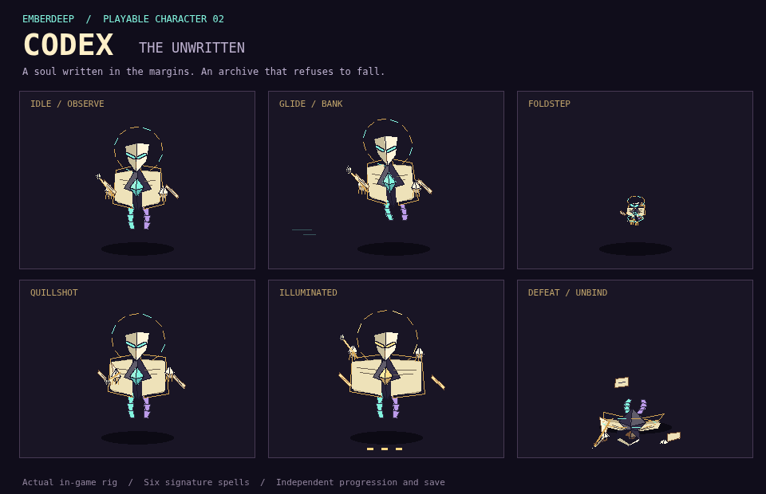

# my-3D2dge

**My "3D" 2D Game Engine.** A general-purpose, retro-modern 2D game engine built for AI models (LLMs). Everything is drawn by code, with no image or sound files, and the whole engine fits in one self-contained HTML file you can hand to any model.

**Play it live: [my-3d2dge.vercel.app](https://my-3d2dge.vercel.app)** (Emberdeep, the signature game). The other demos are [/arena](https://my-3d2dge.vercel.app/arena), [/stress-test](https://my-3d2dge.vercel.app/stress-test) and [/perspective-lab](https://my-3d2dge.vercel.app/perspective-lab), and the starter kits are at /kits/&lt;adventure|animlab|brawler|platformer|rpg|shooter&gt;. The engine for a script tag is [/dist/my-3d2dge.min.js](https://my-3d2dge.vercel.app/dist/my-3d2dge.min.js), and the one-file edition for AI coding agents is [/dist/my-3d2dge-agent.js](https://my-3d2dge.vercel.app/dist/my-3d2dge-agent.js). Every merge to `main` redeploys the site (see `vercel.json`).

## North star

my-3D2dge exists so that any AI model, including older and smaller ones, can **port, remaster, reimagine and remix games from the 8-bit to 64-bit eras** (NES, SNES, Genesis, N64, PS1), and **build spiritual successors** that play like modern remasters. That means modernized visuals, physics and controls, plus a sandbox for mashing up mechanics across titles and genres.

To get there, the engine ships enough perspectives, genre frameworks, vertical-slice modes, features and gameplay mechanics that the quality stays **consistent**, no matter which model is driving.

## How it works

- **The world is 3D; the camera is a classic 2D view.** Game logic lives in world units (x east, y south, z up; one tile = 16). A view projects the world as isometric, three-quarter, top-down, brawler, side-on or a custom angle, and the same game runs in every one of them.
- **Characters are procedural puppets.** Humanoid and blob rigs are 3D skeletons posed by math every step (IK legs and arms, gait, jumps, attacks, capes) and drawn as crisp pixel art. Small things (coins, ships, bullets, icons) can be pixel sprites written as strings.
- **Genre kits that snap together.** Top-down levels (`TileMap` + `Body`), side-scroller levels (`PlatformMap` + `Platformer`), bullets and patterns, dialog boxes, menus, scenes, chip-tune audio, save data. Any kit works with any other, so a shooter can have RPG dialog and a platformer can have Zelda rooms.

## Share it with an AI model

| File | For | Size |
|---|---|---|
| **`dist/my-3d2dge-agent.js`** | **AI coding agents** (Claude Code, Codex, Cursor and the like). The [agent edition](#the-agent-edition-for-ai-coding-agents): the essential engine in one readable file whose header is the whole manual, with three complete example games. An agent reads the header and nothing else. | header ~8k tokens, whole file ~82k |
| **`dist/kits/my-3d2dge-<genre>.html`** | The usual choice for chat models. Minified engine, the API card and the one slice for your genre (`adventure`, `platformer`, `brawler`, `shooter`, `rpg`), or `animlab` to explore the animation system. Fits a 200k context with room to work. | ~119k-130k tokens |
| **`dist/my-3d2dge-compact.html`** | All five slices and the animation lab, engine minified. | ~229k tokens |
| **`dist/my-3d2dge.html`** | The complete reference: readable engine, all five slices and the animation lab. For 1M-token contexts, or for a model that reads the file in parts. | ~275k tokens |

Token counts are approximate (measured with the cl100k tokenizer).

Attach a file and ask for a game ("remake Mega Man 2's first stage", "a Zelda-like with three dungeons", "a spiritual successor to Gradius"). Each file contains:

1. **The API card**: a quick-start game, a table of coordinates per view, rules, common mistakes, the full API and a genre playbook.
2. **The engine** (no dependencies, no network).
3. **A starter game** with five vertical slices to copy from (a genre kit holds one):
   - ADVENTURE (Zelda-style top-down)
   - PLATFORMER (Mario / Mega Man side-scroller with a 2.5D view)
   - BRAWLER (Final Fight / Streets of Rage beat-'em-up)
   - SHOOTER (1942-style vertical shmup)
   - RPG BATTLE (Dragon Quest / Final Fantasy turn-based)
   - ANIMATION LAB: every move, pose and reaction on every skin, in every view, with zoom, rotation, slow motion and frame stepping

The model copies the closest slice and replaces the code between `GAME START` and `GAME END`. Opened in a browser, the same file is playable. Press `?` for the API card, and add `#adventure`, `#platformer`, `#brawler`, `#shooter`, `#rpg` or `#animlab` to the address to jump straight into a slice.

### The agent edition (for AI coding agents)

`dist/my-3d2dge-agent.js` is the engine cut down to what an agent needs to build games, in one readable file. Its header is the whole manual: how to host a game, the mental model, a complete game (title, play, win or lose), the API for every kit, a side-scroller and a shoot-'em-up recipe, and the rules. A coding agent reads those ~8k tokens and builds from them; the code below is there to debug, sectioned by `// ---- N. NAME` banners so it can be grepped.

- **Kept:** the game loop and scenes, keyboard, mouse and gamepad input, every view, the depth-sorted renderer, pixel primitives, string sprites, the 5x7 font and title text, UI windows, dialog and menus, particles and hit effects, the chip synth with every sound effect and song, `TileMap` + `Body` + `FlowField`, `PlatformMap` + `Platformer`, `Bullets` and patterns, the HD `Humanoid` with every pose and move (plus capes, outfits and hats), and `Blob` monsters.
- **Left to the full engine:** canvas and WebGPU lighting, props, parallax backdrops, touch controls, camera zoom and turn, dialog portraits, x-ray silhouettes and afterimages, the classic and skeleton rigs, weapon trails, NES-style dithering, the 3x5 font, and the extra wall, roof and tile materials. Calling one of these in the agent edition does nothing (it warns once), so full-engine code degrades instead of crashing.
- **Compatible upward:** its API is a strict subset of the full engine's, so a game written for it runs unchanged on `dist/my-3d2dge.js`. `npm run test:agent` checks this. It plays every example in the header on both engines, drives a coverage scene through every rig option, pose, move, view and kit, and compares the two APIs name by name.

The file is 82k tokens in all (140k for the readable full engine, 128k-133k for a genre kit). Its source is `engine/my-3d2dge-agent.js`, a curated copy of the engine, so fixes to the full engine are ported to it by hand. `node tools/build.mjs` copies it to `dist/`.

## Try it

| File | What it shows |
|---|---|
| `dist/my-3d2dge.html` | Title menu plus the five vertical slices and the animation lab. Arrows and Enter; `V` changes the view, `-` / `=` or the mouse wheel zoom, `[` / `]` turn the camera where a scene allows it, `0` resets it, `M` mutes. |
| **`examples/emberdeep.html`** | **Emberdeep**, the engine's signature game: a hack-and-slash that goes down forever (see below). Deep links: `#town`, `#depth-7`, `#proving`, `#gallery`, or one gallery entry such as `#gallery/bestiary/husk`, `#gallery/skills/whirlwind` or `#gallery/poses/fall`. |
| `examples/arena.html` | **Emberwell**, an action-RPG arena with WebGPU lighting. One game in four views: isometric (Diablo, Bastion), three-quarter (Zelda, Stardew Valley), top-down and brawler. Keys `1`-`4` or `V` switch, or open `arena.html#threequarter`. |
| `examples/perspective-lab.html` | One room in every view, with lighting and skeleton toggles |
| `examples/stress-test.html` | Up to 5,000 monsters in stick, HD, skeleton or knight rigs that attack with telegraphed moves and fall when beaten; 30 shadow-casting torches, particle storms, camera distance, zoom and turn, a benchmark and a copyable report |
| `examples/scarfrunner-side.html` | The standalone side-scrolling prototype that came before the engine |

## Emberdeep, the signature game

[Play it in the browser](https://my-3d2dge.vercel.app). `examples/emberdeep.html` is a Diablo IV / Path of Exile II style hack-and-slash built on the engine, and it's the showcase for everything above. It grew out of the stress test: the same swordsman (teal tunic, red cape), the same rune hall and the same crowds.

- **Fluid, fast combat.** A slash > backslash > spin combo, a forward dodge roll (a new animation layered on the rig), lunges out of the roll, perfect dodges that slow time, and a potion drunk with an IK-driven arm while you keep fighting. Hit-stop, shake and sparks on every blow, and slow-motion finishers.
- **Skills and a passive tree.** 18 active skills with five ranks and two runes each, on six slots (LMB, RMB, 1-4):
  - melee: cleaves, a whirlwind, lunges, leap slams, launchers that juggle, kicks that bowl bodies into packs, a brawler's flurry, and a thrown sword that returns to his hand;
  - spells: frost nova, chain lightning, meteor, void rift, orbiting spectral blades, a war cry that sends monsters fleeing, a shadow step, and an Echo, a ghostly double of the hero that fights beside him.
  A 199-star passive constellation adds notables and build-defining keystones (Blood Magic, Glass Cannon, Juggernaut...). Past it, seeded rings of deep stars keep waking, and past rank 5 a skill point buys mastery and deeper rune tiers, so every point always buys something.
- **Monsters and bosses.**
  - Husks, skeletons, bone throwers, cultists who raise the dead from the floor, brutes, duelists that sidestep, monks who guard, shield bulwarks you must flank, roosting bats, imps, bloaters, and slimes that split.
  - New procedural rigs: IK-legged crawlers, a burrowing serpent that surfaces in arcs, and a floating Watcher with a sweeping beam.
  - Ten elite affixes.
  - Bosses: the Cinder King on his throne, the Brood Mother, the Deep Wyrm, then composed bosses built from a body, an element and a pattern library.
- **Loot.** Common to legendary and unique items with rolled affixes, roll-quality pips and ranges, and legendary powers. Deep legendaries compose new powers from a vocabulary of triggers and effects, and affix tiers keep coming forever. Gear visibly changes the hero: colors, helms, armor, capes, blades and their elemental trails. A stash chest holds 160 items, and salvage gives crafting materials for the smith and the mystic.
- **Emberhold.** The last lit town, with animated townsfolk: the smith hammers, the mystic floats, the merchant sweeps, the guard patrols, the priestess prays. There are shops, crafting, a stash and the waystone down.
- **One new element per depth.** Each planned depth brings exactly one new mechanic and is named after it: powder kegs (The Powder Vaults), rune wards, chasms, gale vents, magma (The Molten Throne), ice, brood nests, storm pylons, time wells, webs (The Webbed Lair), darkness, blood rush, launch runes, floods, tremors (The Shuddering Descent). A boss waits every fifth depth. You can ignore each element and hack through; speedrunners and power-levelers exploit it.
- **It never ends.** Past the planned depths every level is composed from the same parts:
  - themes recolored by depth;
  - mechanics mixed two at a time, then three (from depth 31) and four (from depth 101), named after the mix ("The Shuddering, Webbed Caverns"), with a card that explains how they combine;
  - packs with elements, shared affixes, giants and swarms;
  - bosses built from a boss body, an element and a set of close, zone and aid patterns;
  - item levels that keep scaling.
- **A gallery.** `#gallery` plays every skill on straw training dummies, every monster's moveset, every boss's entrance, and the hero's full pose vocabulary, in any view and in slow motion.
- **Challenging.** Bosses usually take a real fight and sometimes a second try, and a level-up heals only part of your life. **For playtesting**, Settings has difficulty sliders for hero damage, life and speed (movement, attacks and casting), the same for monsters, plus density, experience and loot. `__ed.botRun({ to: 10 })` lets an autopilot play depth after depth, and the title screen runs it as a demo when left idle.

**Controls:** WASD or the arrows to move, the mouse to aim; LMB, RMB and 1-4 fire the six skill slots; Space or Shift dodges; Q drinks a potion, E talks or picks up, T opens a portal home; I the bag, K the skills, P the passive tree, Tab the map, Z the loot labels, Esc pauses. Open **Controls** from the title, pause menu, or Settings to rebind keyboard, mouse, and controller buttons. Bindings and controller/touch preferences save automatically; conflicts are reported and defaults can be restored. Menu navigation remains available even after movement is rebound.

- **Gamepad:** left stick moves, right stick aims; X/Y/B/LB/RB/RT fire the six slots, A dodges, LT drinks a potion, L3 interacts, R3 opens a portal, View opens inventory, Menu pauses. D-pad or left stick navigates menus, A selects, and Menu goes back. The pause menu also opens Skills and Passives. Controls includes deadzone, aim assist, inverted aim, and a live controller monitor.
- **Touch:** drag the movement side of the screen while pressing an action button with another finger. The overlay provides all six skills, dodge, potion, interaction, map, inventory, portal, and menu. Adjust handedness, size, opacity, and automatic/always/hidden display in Controls. Menus respond to taps; the gallery has Previous/Next, Reel, Replay, and Slow buttons.
- **Developer sandbox:** open **Developer** from the title, pause menu, or Settings. Enabling it makes a disposable copy of your hero; leaving restores the normal hero in town. Experiment with invulnerability, unlimited resources, cooldowns, enemy freeze, simulation pause/frame stepping and speed, lighting, collision circles, performance stats, autopilot, travel to depths 1–500, monster/boss spawning, map reveal, loot, skill unlocks, points, and gold. Sandbox progress and difficulty changes never overwrite your normal save. Reloading abandons the sandbox; returning to town refills the restored hero normally.

The game pauses on focus loss, clears cancelled touch/held inputs, and remembers the selected camera view.

**A second playable character: Codex, the Unwritten.** Choose **CHARACTER → Codex → PLAY AS CODEX** on the title screen, or [start as Codex](https://my-3d2dge.vercel.app/?character=codex). A separate save keeps your Wanderer intact. Codex is a living archive with a porcelain mask, hinged folio body, detached hands, a writing quill, orbiting leaves and trailing bookmarks. A custom procedural rig glides and banks, folds into a sigil to dodge, writes spells, drinks, reacts, falls apart and reforms; inventory, echoes, gallery and every camera view use that identity.

Codex starts with six signature spells. **Quillshot** charges three manuscript pages; the next signature spell becomes **Illuminated**. **Margin Seal** traps a pack, **Razor Folio** throws returning pages, **Revision** restores life and a dodge, **Living Index** orbits cutting leaves, and **The Last Word** draws foes into an exploding book. Upgrade ranks and runes, mix in shared skills, equip loot, craft, and spend passive points as usual. The hover is visual: terrain and hazards still apply.



[Watch the animated rig](docs/assets/codex-motion.gif) · [Character design and verification](docs/CODEX.md)

The source is `src/emberdeep/*.js`, joined into one script. `src/emberdeep/DESIGN.md` explains the modular "language" (registries for elements, skills, monsters, affixes, bosses, patterns, items, powers, mechanics, themes and layouts). `tools/ed-play.mjs` (scripted headless playtests) and `tools/ed-smoke.mjs` (every scene and depth) test it.

## What's in the engine

`engine/my-3d2dge.js` has no dependencies.

**Views and rendering**
- Five preset views plus custom views (yaw, pitch, scale).
- Fixed console resolutions: `res: 'nes' | 'snes' | 'genesis' | 'gb' | 'gba' | 'ps1' | [w, h]`.
- Pixel-snapped primitives with world-anchored dithering.
- Depth-sorted rendering with outlines, rim light, hit flash, afterimages and x-ray silhouettes.
- Dithered skies and parallax starfields.

**The look kit (v0.6: aimed at PS1 / N64 era 2D, not NES)**
- HD characters: volumetric, shaded limbs, a shaped torso, hands and boots.
  - Faces: eyes with catch-lights, brows, mouth, ears.
  - Side views get a cheated 3/4 turn so bodies read in profile, and swords chop in the screen plane.
  - Steep top-down views draw characters from a lower, sprite-like angle so faces show, like SNES RPG sprites.
  - Weapon trails follow the real blade, fist or foot path in every view.
  - Builds: `chibi`, `heroic`, `bulky`, `skeleton`.
  - Poses: cheer, cast, guard, kneel, and knocked down.
  - Outfits: tunic, robe, coat. Plus armor, sleeves and hats.
  - Hair: short, spiky, long, ponytail. Long hair and ponytails flow like cloth.
  - `size` for 40-60 px heroes.
- Hue-shifted shading everywhere (`E.tones`, `E.ramp`): shadows lean cool, highlights warm.
- `E.Backdrop`: parallax scenery with atmospheric haze.
  - Layers: mountains, hills, forest, city, castle, clouds, sea, fog, stalactites; sun or moon, stars.
  - Presets: `day`, `dusk`, `night`, `castle-night`, `city-night`, `desert`, `forest`, `ocean`, `cave`, `space`.
- Textured tiles: stone with moss, bricks, wood, riveted metal, grass-topped ground, with carved edges. Floors get contact shadows and water/lava shimmer.
- Wall materials for top-down, iso and brawler maps: brick, stone, rock cliff, planks, Tudor timber, plaster and hedge, with tiled roofs, paving, leafy or grassy tops.
- 39 procedural props (`r.prop`):
  - lights with animated, glowing flames: torches, candles, chandeliers, lanterns, street lamps, fire drums;
  - stained-glass windows, banners, pillars (whole or broken), statues;
  - chests and doors (shut or open), crates, barrels, sandbags;
  - trees, palms, cactus, mushrooms, vines, cobwebs;
  - awnings, hydrants, trash cans and more.
- Character close-ups: `talk.say(lines, { portrait: rig })` puts a live face beside every dialog line; `rig.drawPortrait` draws one on HUDs and menus. Radio chatter (`auto`, `modal: false`) keeps talking while you play.
- Effects: `particles.explosion` (fireball, smoke, sparks, debris, shockwave, shake, sound), fire, smoke, glints, and screen `flash`. Smoke and fire are hard-edged puffs in flat tones, not soft blurs. `game.hitFx` adds hit-stop, an impact star, sparks, a bouncing damage number and a sound in one call, and hit flashes keep the sprite's shading.
- Typography: a 5x7 proportional pixel font with lower case, drop shadows and gradients, plus `E.font.title` for extruded gradient logos.

**Characters and animation**
- `Humanoid`, with:
  - weapons: sword, gun, staff
  - capes, jump pose, aiming up and down, ladder climbing
  - squash and stretch, and skeleton debug view
  - `style: 'classic'` stick figures for huge crowds
- A move library, `E.MOVES`:
  - blades and clubs: slash, backslash, overhead, rising, thrust, spin, plunge, two-handed;
  - fists: jab, cross, hook, uppercut, haymaker, elbow;
  - kicks: front kick, roundhouse, sweep, flying kick, knee, axe kick;
  - other: cast, throw, bash, claw.
- Every move has anticipation, a committed strike (lunge, step, lean, torso twist), follow-through and a clean return to the stance. The same move fits every build and view, and horizontal swings become screen-plane chops in side views. `E.Combo(['jab', 'cross', 'hook', 'uppercut'])` chains them.
- Stances (`guard`, `ready`) and poses: cheer, cast, guard, kneel, crouch, wave, hands on hips, knocked down. Idle rigs breathe and shift their weight.
- `Blob` for slimes and round monsters, with optional ears, horns, bat wings, feet, a tail and fangs.
- Pixel sprites from strings.

**Levels and physics**
- `TileMap` for top-down, isometric and brawler levels:
  - ASCII levels with spawn tags and floor tags, extruded walls and camera cutaway
  - floor tags that block walking (deep water, lava), which pathfinding avoids
  - height-aware collision, so bodies can jump onto blocks
  - flow-field pathfinding, and procedural floor textures (stone, grass, dirt, water, planks, checker)
- `PlatformMap` for side-scrollers:
  - tile kinds: solid, one-way, ladder, hazard, background and decoration
  - tile styles: ground, brick, block, bonus, pipe, spikes, liquid
  - drawn flat in the side view and as 2.5D in tilted views
- `Platformer` controller:
  - coyote time, jump buffering and variable jump height
  - ladders, dropping through one-way platforms, riding moving platforms
  - optional double jump, wall jump and dash
- `Body` for top-down physics: friction, bounce, knockback, and jumping onto blocks.
- `Bullets` with patterns (aim, spread, ring), and a `SpatialHash` for crowds.

**Game structure**
- Scenes (title, play, game over) with per-scene view, keys and resolution.
- Pause, timers (`after`, `every`), hit-stop, screen shake and slow motion.
- A camera with bounds and room-by-room movement, plus zoom and rotation (`game.setZoom`, `game.rotateView`): the world re-rasterizes crisply at any size while the HUD stays put.
- Save data (`E.store`).

**Input**
- Keyboard, mouse, gamepad and touch (stick plus on-screen buttons).
- Presets for action, platformer and shooter games.
- `pressed`, `repeat` and buffered presses.

**Text and UI**
- A 5x7 proportional pixel font (plus the old 3x5 as `font: 'tiny'`) with scale, alignment, word wrap, shadows and gradients.
- Window boxes, bars and hearts.
- Typewriter `Dialog` boxes with names and choices, and `Menu` with a cursor.

**Sound**
- A chip synthesizer with no audio files: square, pulse, triangle, saw, sine and noise.
- About 30 preset sound effects and a step sequencer.
- Five built-in original songs: title, adventure, dungeon, boss and victory.

**Lighting and translucency**
- Colored lighting that works everywhere, no WebGPU needed:
  - dark areas take a smooth cool tint and each light adds its own color;
  - flames, sparks, bullets and anything marked `emissive` stay bright.
- Real translucency in 1/8 steps with add, multiply and screen blending, like PS1 and SNES hardware. Shadows, glows, fog, skies, fades and flashes use it. `E.style.trans = 'dither'` switches to NES, Game Boy or Genesis-style dithering.
- Optional WebGPU lighting: soft shadows cast by walls, light wrap, glow, bloom and heat shimmer. It falls back to the Canvas lighting automatically.

**Built for models**
- Clear errors in an on-screen box, with one-time warnings for common mistakes (unknown view, action, sound, legend character or wall type, or a bad color).
- Forgiving inputs: `'#rgb'` colors, canvas lookup by id, string presets.

## Genre coverage

| Era genre | View | Kit |
|---|---|---|
| Platformers, Metroidvanias, run-and-guns (Mario, Mega Man, Metroid, Contra) | side, or brawler for 2.5D | PlatformMap, Platformer, Bullets |
| Action adventures and action RPGs (Zelda, Secret of Mana, Diablo, Landstalker) | three-quarter, top-down, iso | TileMap, Body, Humanoid, Dialog |
| Beat-'em-ups and fighting (Final Fight, Streets of Rage, Street Fighter II) | brawler, side | Humanoid attack and kick specs, hitboxes |
| Shoot-'em-ups (1942, Xevious, Gradius) | overhead, side | sprites, Bullets, patterns, starfield |
| JRPGs (Dragon Quest, Final Fantasy, EarthBound) | three-quarter towns, brawler battles | Menu, Dialog, scenes, store |
| Puzzle and arcade (Tetris, Dr. Mario, Pac-Man) | overhead | fixed res, `input.repeat`, pixel primitives |
| 3D-era remakes (Mario 64, Ocarina, Crash) | iso, three-quarter, brawler | TileMap blocks with heights plus Body jumping (z is real height) |

## Build and check

The source of truth is `engine/my-3d2dge.js` plus the game scripts and templates in `src/`. To regenerate `examples/` and `dist/`, run:

```
npm install                  # once: Playwright (checker) and terser (compact build)
node tools/build.mjs
```

This writes:
- the `examples/`;
- `dist/my-3d2dge.html` and `dist/my-3d2dge-compact.html`;
- the genre kits in `dist/kits/`;
- the engine alone as `dist/my-3d2dge.js` and `dist/my-3d2dge.min.js`, for multi-file projects;
- the agent edition as `dist/my-3d2dge-agent.js` (copied from `engine/my-3d2dge-agent.js`).

To test any game file in a headless browser, run the checker:

```
npx playwright install chromium   # once
node tools/check.mjs dist/my-3d2dge.html#platformer
npm test                         # rebuild, syntax, controls + developer browser regressions
npm run test:smoke -- --secs 2    # title, town, gallery, proving, depths 1–20
npm run test:smoke -- --character codex --secs 2 --out check-output/codex-smoke
npm run test:codex                # character, spells, progression, saves and device checks
npm run test:agent                # agent edition: header examples and a coverage scene on both engines, API subset
```

To check an animation frame by frame, record a contact sheet:

```
node tools/filmstrip.mjs dist/my-3d2dge.html#brawler --steps "wait:1500 press:Enter wait:800 rec:16:2 press:KeyJ" --crop 20,60,150,140
```

`--seed 1` makes the strip repeatable: time is virtual and randomness seeded, so the same command gives the same frames, pixel for pixel. `--compare other.html` records the same steps from a second build and marks every pixel that differs, to check that a change did only what it should:

```
node tools/filmstrip.mjs "examples/emberdeep.html?view=threequarter#gallery/bestiary/husk" --seed 1 --steps "wait:200 rec:16:36" --compare before.html
```

The checker presses start and plays the game (move, jump, attack, fire), then cycles the game's views. It reports errors, engine warnings, frame times, how much of each screenshot is filled, and look notes that flag cheap-looking frames (a thin palette, large flat areas, checkerboard dithering, low contrast). It fails (exit code 1) on any error, or when gameplay leaves the screen blank.

## Docs

- `API.md`: the API card, about 11,019 tokens. It is embedded in every single-file edition.
- The header of `dist/my-3d2dge-agent.js`: the agent edition's manual, about 8,400 tokens, with three complete example games.
- `AI_GUIDE.md`: the full guide for models and people. It covers frame order, every system, genre recipes, the remake workflow and a pre-handoff checklist.
- `docs/ANIMATION-RESEARCH.md`: famous animations for every view and genre the engine covers, what the engine can already draw, and a ranked list of animations to ship ready-made.

## License

MIT
