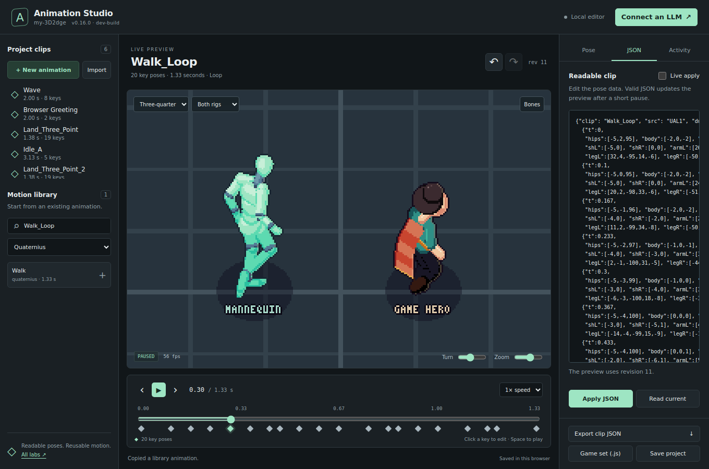
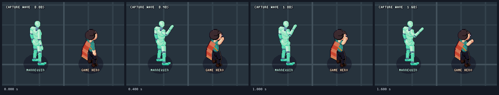

# Animation Studio

Animation Studio lets a person and an AI agent work on the same animation. The browser shows the current clip. An agent can read its poses, change them, and inspect the result. Accepted changes appear in the open preview without a page reload.

The studio uses the engine's readable humanoid clips. It can start with a new clip or with a clip from the supplied libraries. It keeps animation data as text, with source and license records.



The timeline and JSON panel edit the same clip. The source mannequin and game hero show how that motion fits each body.

## Start the studio

Use Node.js 20 or later. From the repository directory, run:

```sh
npm install
npm run build
npm run animation:studio
```

For agent image capture and browser tests, install Chromium once:

```sh
npx playwright install chromium
```

If Chromium is already installed, you can set `CHROMIUM_PATH` to its executable path instead.

Open **[http://127.0.0.1:4173](http://127.0.0.1:4173)** in your browser. Keep the command running while you work.

The server creates `.animation-studio/project.json`. It watches this file for changes. A coding agent can edit the file, or use the MCP tools described below. The browser receives each accepted change and updates the preview.

The local server and the browser page have different uses:

| Use | Open | What it supports |
|---|---|---|
| Work with an agent and see live changes | `http://127.0.0.1:4173` | Shared project, file watching, MCP, HTTP commands, and image capture |
| Inspect or edit a clip without the local server | `examples/animation-studio.html` or the hosted studio page | Browser controls and file import or export |

A hosted static page cannot watch a file on your computer. Start the local server for a shared session with an agent.

To use another port or project file, run:

```sh
npm run animation:studio -- --port 4174 --file ./my-animation/project.json
```

The server accepts connections on the local computer at `127.0.0.1`. It does not expose the project to other computers.

## Connect an LLM

The studio does not include an LLM. Use a client that supports MCP over standard input and output, or a coding agent that can edit local files.

### MCP client

Start the studio server first. Add a server entry to your MCP client's configuration. Replace the example path with the absolute path to your clone:

```json
{
  "mcpServers": {
    "animation-studio": {
      "command": "node",
      "args": [
        "/absolute/path/to/my-3d2dge/tools/animation-mcp.mjs"
      ]
    }
  }
}
```

Configuration files differ between clients. Use the entry above in the location that your client requires. The MCP process connects to `http://127.0.0.1:4173` by default. If you start the studio on another port, add `"--url"` and the server URL to `args`.

### MCP tools

The client discovers these tools and their input fields through MCP:

| Tool | Input | Result |
|---|---|---|
| `animation_catalog` | Optional `query`, `set`, `limit`, and `offset` | Find existing library clips without reading all their poses. |
| `animation_get` | Optional `id` and `includeSchema` | Read the current revision, project, clip, and pose format. |
| `animation_create` | `expectedRevision`, `name`; optional `duration`, `loop`, `preset`, `set`, and `fromClip` | Create new motion, or copy a library clip with `fromClip`. |
| `animation_edit` | `expectedRevision`, `action`; optional `summary` | Apply a structured edit to the shared project. |
| `animation_preview` | Optional `id`, `time`, `playing`, `speed`, `view`, `cast`, `bones`, `facing`, and `zoom` | Set the controls in connected previews. |
| `animation_capture` | `times`; optional `id`, `view`, `cast`, `bones`, `facing`, and `zoom` | Return a PNG image with one or more frames. |
| `animation_history` | `expectedRevision` and `direction`: `undo` or `redo` | Restore an earlier or later project state. |
| `animation_export` | Optional `id` and `format`: `json` or `js` | Export one clip as a native animation set, with its source data. |

Use `animation_get` with `includeSchema: true` before the first edit. The schema describes the pose fields and accepted actions. Use a new revision for each edit that follows another accepted edit.

`preset` is `neutral` or `wave`. Both presets generate new keys. A source set supplies the body's proportions. To change an existing movement, use `set` and `fromClip`.

Capture accepts one to eight times in seconds, within the clip duration. For example, use `{"times":[0,0.4,1,1.6],"view":"side","cast":"both"}` for a two-second clip. The result includes the captured revision and the sample times. The MCP tool returns the PNG as image content that a client can show to a model.



This frame strip comes from the capture tool. The browser tests verify that repeated captures at the same times have identical pixels.

The five standard views are `iso`, `threequarter`, `topdown`, `brawler`, and `side`. The cast is `mannequin`, `hero`, or `both`. `facing` uses degrees. `zoom` ranges from `0.5` to `3`. Preview controls do not change animation keys. An `id` can show another project clip without changing the saved selection.

If `id` is omitted from an MCP or HTTP preview request, the preview uses the saved project selection.

### Example prompts

Keep the studio page open beside your conversation. You can ask the agent:

> Create a two-second greeting. Raise the right hand, move it from side to side twice, then return to rest. Keep the feet in place. Show the clip on the mannequin and the hero. Inspect a frame strip, then correct any sudden changes.

For an existing clip, identify the source and describe the change:

> Find a walking clip in the supplied libraries. Make a copy, reduce the arm swing, and keep the original source records. Show the result in side view at half speed. Capture a frame strip so that you can check the step timing.

### Coding agent with file access

Give the agent the path to `.animation-studio/project.json` and this document. Tell it to read the current project before each change. It must preserve required pose fields and source records.

The file is the whole project. Use a complete JSON write, or write a temporary file and rename it over the project file. The server validates the new document before it changes the live preview. An incomplete or invalid edit leaves the last valid preview in place.

Correct an invalid project file before you send another edit. The server rejects writes while that file is invalid. This prevents a later command from silently discarding an incomplete file edit.

## Read, edit, inspect

Use a short cycle for each change:

1. Read the current project, revision, clip, and pose format.
2. Make one specific change. Supply the revision that you read.
3. Inspect the updated pose data and the preview.
4. Capture a still frame or a frame strip. Check the motion at several times and views.
5. Keep the change, correct it, or use Undo.

The revision prevents an old command from replacing a more recent edit. This check applies to MCP and HTTP writes. A direct file save replaces the complete project. If the server reports a revision conflict, read the new state. Apply the intended change to that state. Do not retry an old replacement unchanged.

An incoming edit keeps an unsaved JSON draft in the editor. The draft still has its earlier revision. Use **Read current** to replace the draft with the latest clip before you prepare another edit.

Undo and Redo change the shared project. They also update every connected preview. Each accepted state change receives a new revision. The session keeps up to 50 history states. The project file persists after a restart; undo history does not.

### Structured edits

Send the following object as `action` in `animation_edit`. Replace the example clip name with the selected clip ID:

```json
{
  "type": "edit_key",
  "id": "Wave",
  "time": 0.8,
  "values": {
    "armR": [0, 0, 100, 35, 0]
  }
}
```

This action puts the right arm above the shoulder with a 35-degree elbow bend. At a new time, the model first creates a key from the interpolated pose. It then replaces the specified channels. The other channels keep their interpolated values.

| Action `type` | Additional fields | Change |
|---|---|---|
| `create` | `name`; optional `duration`, `loop`, `preset`, `set` | Create a new clip. |
| `import` | `set`, `clip`; optional `name` | Copy one clip from a supplied library. |
| `add` | `set`, `clip` | Add a complete readable clip object or JSON text. |
| `select` | `id` | Select a project clip. |
| `replace` | `id`, `clip` | Replace the complete readable clip. |
| `edit_key` | `id`, `time`, `values` | Insert or change one key pose. |
| `delete_key` | `id`, `time` | Remove one key after the first key. |
| `transform` | `id`, `kind`: `mirror`, `reverse`, or `retime`; `duration` for `retime` | Change sides, playback order, or total duration. |
| `rename` | `id`, `name` | Change the clip ID and its name. |
| `delete` | `id` | Remove a clip. The project must keep at least one clip. |

To copy a project clip, read it, change its `clip` name, and use `add` with the same `set`.

### HTTP interface

An agent without MCP can use the same local service through HTTP:

| Endpoint | Use |
|---|---|
| `GET /api/state` | Read the project, revision, and history status. |
| `GET /api/schema` | Read the pose and action schemas. |
| `GET /api/catalog?query=walk&set=quaternius` | Find library clips. |
| `GET /api/clip?set=quaternius&name=Walk_Loop` | Read one source clip. |
| `POST /api/action` | Apply `{expectedRevision, action, source, summary?}`. |
| `GET /api/project` | Read the project document. |
| `PUT /api/project` | Replace it with `{expectedRevision, project}`. |
| `POST /api/preview` | Change preview controls. |
| `POST /api/capture` | Capture exact times with the same fields as `animation_capture`. |
| `GET /api/export?id=Wave&format=js` | Download a native set. |
| `GET /api/events` | Receive live state, preview, and validation-error events. |

Send JSON requests with `Content-Type: application/json`. Use `source: "agent"` for an agent edit. A stale revision returns HTTP `409`. A validation error includes a message that identifies the problem.

## Work with clips

The timeline gives each key pose a time in seconds. The clip stores named fields for the hips, body, head, shoulders, arms, legs, and feet. Most pose values use whole numbers. The [readable format guide](MOCAP.md#the-readable-format-for-ai-models) explains the units and coordinate frame.

Start with a new clip when you need a new action. Start with a library clip when you need to keep an existing movement. Use the pose controls or readable clip text to change the result. Use several views to check a change that is hard to see from one direction.

The studio shows the source mannequin and the engine's hero. The engine fits the same movement to the hero's body proportions. The bone display helps you inspect limb positions.

### Import and export

Save a project when you need to continue editing it later. Export a readable clip or a single-clip set when you need to use the result in a game. Keep the source records with the exported clip.

The browser's **Import** control accepts a project, a clip record, or one bare readable clip JSON object. **Export clip JSON** saves a record with two fields: `set` is the source set ID; `clip` contains the complete readable clip. Use the exported record unchanged to keep its reference body when you import it again. If a bare clip matches more than one source set, the editor asks you to select the reference set.

The **JSON** panel shows the bare readable clip for direct pose edits. **Game set (.js)** includes the reference bodies and credits that the game's animation loader needs. The MCP export tool returns a native set in either JSON or JavaScript form.

The studio edits the repository's native readable format. It does not directly import arbitrary FBX, GLB, BVH, Blender, or video files. For supported capture files, use the existing [motion capture import pipeline](MOCAP.md#pipeline). Some skeletons require a bone map before conversion.

The page includes the Quaternius, Mesh2Motion, CMU, and Hero reference sets. An imported clip must use a source body from a set that the page includes. To add a different reference set, add its readable set file to `src/mocap/sets/`. Include that file in `src/animation-studio.template.html`, then rebuild the page. The local server reads sets from `src/mocap/sets/` when it starts.

Each imported clip retains its source and original clip or take reference. Native set exports include the source library's credit and license records. For new motion, the `authored` tag identifies keys made in the studio. The source set still supplies the reference body's proportions. Use `desc` for additional author notes. An edit does not change the license of the animation it used.

## Browser automation

The page exposes `window.__animationStudio` for automation:

| Member | Use |
|---|---|
| `ready` | Check whether the studio is ready. |
| `game` | Access the engine through its public API. |
| `project` | Read the current project. |
| `state` | Read the preview clip ID, time, playback, camera, and figure settings. |
| `getSnapshot()` | Read the studio state. |
| `loadSnapshot(snapshot)` | Load a validated snapshot for a controlled preview. |
| `seek(time)` | Inspect a time in seconds. |
| `setPreview(options)` | Set `id`, `time`, `playing`, `speed`, `view`, `cast`, `bones`, `facing`, or `zoom`. |
| `apply(action)` | Apply a project action. |

The preview canvas has the ID `screen`. A capture can stop playback, seek to exact times, and read this canvas. Use exact sample times for a repeatable frame strip.

## Checks

Build before you test a browser page. The browser checks use Playwright. Set `CHROMIUM_PATH` if Chromium is installed outside Playwright's default location.

The studio tests cover project validation, editing, undo and redo, live updates, file watching, and capture. The browser test also checks the figures in each view and the layout on a narrow screen. Test images are written to `check-output/`.

To run the browser and live-session checks directly:

```sh
npm run build
node tools/studio-browser-test.mjs
```

For the repository's selected checks, run:

```sh
npm run test:changed
```

The page is generated from `src/animation-studio/` and its template. Make source changes there, then run `npm run build`. Do not edit the generated page in `examples/`.
