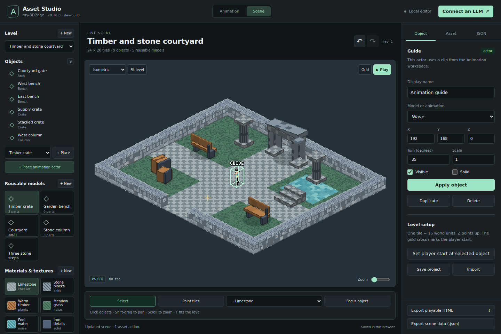

# Asset Studio

Asset Studio lets a person and an AI agent build the same scene. It adds readable models, procedural materials, placed objects, and tile levels to [Animation Studio](ANIMATION-STUDIO.md). An actor in a level can use a clip from the animation project. When the agent changes that clip, the actor shows the change too.

For first calls, efficient replies, safe retries, and the full MCP workflow, start with [Studio agents](STUDIO-AGENTS.md).

Keep the browser beside the conversation. Describe a change, let the agent apply it, and judge the result in the open scene. Accepted edits update the browser without a page reload or a rebuild. The agent can request an image in the same call that changes the scene.



## Start a shared session

Use Node.js 20 or later. From the repository directory:

```sh
npm install
npm run build
npm run asset:studio
```

Open **[http://127.0.0.1:4173/asset-studio](http://127.0.0.1:4173/asset-studio)**. Keep the server running. `asset:studio` and `animation:studio` start the same server; do not start both on the same port. The **Animation** and **Scene** controls switch workspaces in the same page.

For image capture, install Chromium once:

```sh
npx playwright install chromium
```

If Chromium is already installed, set `CHROMIUM_PATH` to its executable. Capture uses a separate browser, so it does not move the human's camera or change the current play mode. The server keeps that browser available for later captures.

The shared project is `.animation-studio/project.json`. It contains the animation clips and an optional `assets` section. Old animation-only projects still load. Until the first asset edit, the scene view can show a sample courtyard without changing the saved file.

To use a different project or port:

```sh
npm run asset:studio -- --port 4174 --file ./my-project/project.json
```

The server listens on the local computer at `127.0.0.1`. A hosted studio page supports browser editing and inspection. A saved HTML export opens the playable level. The local server is needed for shared MCP, HTTP, and watched-file edits.

## The short edit-and-inspect cycle

1. Ask the agent to read `scene_get` and discover `asset_catalog` with `includeSchema: true`.
2. Give one direction, such as “make the arch wider and the path warmer.”
3. The agent sends one `scene_edit` batch with the current revision. It can include `capture` to receive an image with the saved result.
4. Inspect the open scene. Give the next direction, keep the result, or use Undo.

The agent does not need to read the whole project for each change. The default scene response contains a small inventory, the current revision, and the selected level's objects. It can inspect one model, material, level, or object by ID. Use `full: true` when the complete project is needed.

One batch contains 1 to 100 actions. The server validates the complete result before saving it. A failed action leaves the whole batch unapplied. A valid batch makes one revision and one Undo step, even when it changes several asset types.

### Example prompts

> Build a small stone courtyard with a timber arch and two benches. Leave a clear path through the center. Use readable procedural models. Show the result in three-quarter view and send a capture after the edit.

> Make the wood darker and the bench seats wider. Keep their positions. Apply the changes in one batch so I can undo them together.

> Put the current greeting animation beside the gate. Capture the scene at 0, 0.4, 1, and 1.6 seconds. Raise the character's hand if the greeting is hard to see.

> Add a second level with a flat floor. Reuse the courtyard's materials and models. Place three crates, then show the level so I can give the next direction.

### Work in the browser

Choose a model and add an object, or add an actor from the current animation. Select a placed object in the list or on the canvas. The **Object** tab changes its name, position, rotation, and scale. The **Asset** tab changes a material's colors and pattern, and the chosen model's part JSON. The **JSON** tab edits the complete assets document, including ASCII level rows.

Use **Paint tiles** with a tile brush to change the level floor. Drag a stroke, then release to save it as one edit. **Fit level** adjusts the camera to the scene's bounds, within the engine's zoom range. Large levels can extend beyond the view at the minimum zoom; shift-drag to pan, scroll to zoom, or use **Focus object**. Choose a different camera view when depth or height is hard to judge.

Use **Play** to move through the level with WASD or the arrow keys; Space jumps. On a touch screen, drag the left side to move. An agent can still change the scene during play. Return to edit mode to select or paint. Browser controls and agent commands share the same Undo and Redo history.

## Connect an LLM client

Asset and animation tools use the same MCP process. An existing Animation Studio MCP configuration gains the asset tools after the update. For a new client, add:

```json
{
  "mcpServers": {
    "animation-studio": {
      "command": "node",
      "args": [
        "/absolute/path/to/my-3d2dge/tools/animation-mcp.mjs"
      ]
    }
  }
}
```

Replace the path with the absolute path to your checkout. For a different server address, add `"--url"` and `"http://127.0.0.1:4174"` to `args`. Start the studio server before the MCP client.

### Asset tools

The six asset tools work beside eight animation tools and the shared `studio_status` and `studio_import` tools:

| Tool | Use |
|---|---|
| `asset_catalog` | Discover presets, part shapes, texture patterns, limits, and action examples. `includeSchema: true` adds the exact JSON schemas. |
| `scene_get` | Read the current revision and a compact inventory. Use `type` and `id` to inspect a `material`, `model`, `level`, or `object`. Use `level` for an object in another level. |
| `scene_edit` | Send `expectedRevision`, an `actions` array, and optional `requestId` and `summary`. Add `capture` to get a PNG in the same reply. |
| `scene_preview` | Set `level`, `view`, `zoom`, `focus`, `selected`, `grid`, `time`, `playing`, or `mode`. Preview settings do not save assets or add history. |
| `scene_capture` | Return a PNG still or frame strip for one level at exact times. |
| `scene_export` | Export readable JSON or a link to a self-contained HTML page. `inline: true` explicitly requests all the HTML text. |

`scene_get` and `scene_edit` report the same revision used by `animation_get` and `animation_edit`. Use `animation_history` with `direction: "undo"` or `"redo"` to undo either kind of edit.

Call `studio_status` first to check editor connections, project-file errors, and capture setup. Use `studio_import`
to load a complete project or scene JSON export with the same revision protection and Undo history. Default JSON
results include structured content. Use `full: true` only when you need all the project's data.

Capture accepts 1 to 8 scene times from 0 to 600 seconds; the default is `[0]`. The five views are `iso`, `threequarter`, `topdown`, `brawler`, and `side`. `zoom` is from `0.5` to `3`. `focus` is a world point `[x,y,z]`. Use `selected: null` and `grid: false` for a clear image without an object outline or edit grid.

Capture results identify their revision and sample times. MCP returns the PNG as image content for a client that supports image input. If an edit succeeds but image capture fails, the reply contains `captureError` and the saved revision. **Do not repeat the edit.** Fix capture or request another image of the saved scene.

### One batch, with an image

This example uses the built-in courtyard assets. Read `scene_get` first and replace `123` with its revision:

```json
{
  "expectedRevision": 123,
  "requestId": "path-crate-001",
  "summary": "Darken the timber and place a crate beside the path",
  "actions": [
    {
      "type": "material_update",
      "id": "wood",
      "changes": {
        "color": "#995544",
        "accent": "#442211",
        "pattern": "planks"
      }
    },
    {
      "type": "object_add",
      "id": "PathCrate",
      "object": {
        "kind": "model",
        "model": "Crate",
        "position": [224, 192, 0],
        "rotation": 15
      }
    }
  ],
  "capture": {
    "view": "threequarter",
    "times": [0],
    "grid": false,
    "selected": null
  }
}
```

Send this as the arguments to `scene_edit`, or as JSON to `POST /api/scene/edit`. Changing `wood` updates every model part that refers to that material. `PathCrate` is a new placed object; the reusable `Crate` model is unchanged.

## Readable asset format

The optional `project.assets` document has `schema: 1`, registries for `materials`, `models`, and `levels`, plus `selectedLevel` and `selectedObject`. Asset IDs start with a letter and contain up to 64 letters, digits, underscores, or hyphens. Display names can contain spaces.

| Asset | Data an agent edits |
|---|---|
| Material | `name`, six-digit hex `color` and `accent`, `pattern`, pattern `scale`, and deterministic `seed`. Patterns are `solid`, `checker`, `brick`, `planks`, and `noise`. |
| Model | `name`, `tags`, and a list of parts. Each part has `shape`, `position`, `size`, `rotation`, and a material ID. Shapes are `box`, `wedge`, and `cylinder`. |
| Placed object | `kind: "model"`, a model ID, display name, position, rotation, scale, visibility, and whether it is solid. Many objects can use one model. |
| Animated actor | `kind: "actor"`, a project `clip` ID, and the same placement fields. It reuses the clip, including its source body. |
| Level | Tile size, readable row strings, a tile-symbol dictionary, placed objects, and a spawn point. Each tile type has a material, height, and solid flag. |

Coordinates are world units, with **`z` up**. A position is `[x,y,z]`. A part's position is the center of its bottom face; its size is `[width,depth,height]`. Rotation is in degrees around `z`.

Tile coordinates are integer columns and rows: `rows[y][x]`. The center of a tile is `[(x + 0.5) * tile, (y + 0.5) * tile, 0]`. Use `paint` for individual cells and `fill` for a rectangle. For example:

```json
{
  "type": "fill",
  "x": 4,
  "y": 4,
  "width": 3,
  "height": 2,
  "tile": "."
}
```

The tile symbol must exist in that level's `tiles` dictionary. Materials, models, and animation clips must also exist when the batch finishes. Related records can be created in the same batch. The validator rejects unknown fields, broken references, and values outside the published schema.

### Actions

| Action | Main fields |
|---|---|
| `material_create`, `material_update`, `material_delete` | `id`, and `material` for create or `changes` for update. |
| `model_create`, `model_update`, `model_delete` | `id`, and `model` for create or `changes` for update. |
| `level_create`, `level_update`, `level_delete` | Level `id`; optional `level` for create or required `changes` for update. Create without level data starts a flat floor. |
| `object_add`, `object_update`, `object_delete` | Object `id`, optional `level`, and `object` for add or `changes` for update. |
| `object_duplicate` | `id`, `newId`, optional `level`, and optional `[x,y,z]` `offset`. |
| `paint` | `cells: [{x,y,tile}]`, plus optional `level`. |
| `fill` | `x`, `y`, `width`, `height`, `tile`, plus optional `level`. |
| `select` | `level` and/or object `id`. Use `id: null` to clear the object selection. |
| `load_preset` | `preset: "courtyard"` or `"empty"`. Replaces the asset workspace; animation clips are retained. Undo can restore the prior assets. |

For new geometry, create a model from parts. Change the model's `parts` to update every placed copy. To vary one placement, change the object. To vary the geometry of one copy, create a second model and point that object to it.

To add an actor, use an existing project clip ID:

```json
{
  "type": "object_add",
  "id": "Greeter",
  "object": {
    "kind": "actor",
    "clip": "Wave",
    "position": [192, 160, 0]
  }
}
```

Use the animation tools to author or copy the clip first. The scene keeps a reference to it. A later pose edit appears in the scene and does not require another import.

## Shared state, drafts, and exports

The browser controls, JSON editor, MCP tools, HTTP endpoints, and watched file all use the same validated data. They share Undo and Redo. The session keeps up to 50 history states; saved project data survives a restart, but Undo history does not.

A write needs the revision that the agent or editor last read. If another edit arrived first, HTTP returns `409` and
MCP reports a structured revision conflict. Use a unique `requestId` for each intended write. If its response is lost,
resend that ID and exactly the same arguments, including the original revision. A replay returns the original receipt
and image without applying the edit again. `currentRevision` may be newer than the receipt's `revision`; read current
state before preparing another edit. After restart, receipt expiry, or a conflict, inspect whether the earlier change
already happened. Do not blindly repeat a duplication or Undo. A direct file save replaces the complete project, so
read the file before changing it and preserve the clip and source records. See [retry rules](STUDIO-AGENTS.md#retry-rules).

Incomplete or invalid JSON leaves the last valid scene on screen. The server rejects other writes until an invalid watched file is repaired. This prevents a later command from silently discarding a file edit that is still in progress.

**JSON export** contains the selected level, readable materials and models, and the clips needed by its actors. It is wrapped as `{schema, level, revision, project}`. Its `project` is a complete animation-and-assets project that the studio can load.

**HTML export** includes the engine, data, and reference sets in one file. MCP returns a compact descriptor and download
link by default, with its revision, byte count, and SHA-256. The link retains the exact exported data after later edits
and remains available during the server session until its bounded cache expires. `inline: true` requests the HTML text.
Download and open the file without the local server to play the level. It starts in a full-screen play view with camera
controls. For further editing, import the JSON export through the browser or `studio_import`, or continue in the original
shared project. JSON can also be downloaded through a link by setting `inline: false`.

This version creates procedural part models and procedural textures. It does not import GLB, FBX, Blender, PNG, or JPEG assets. Animation file conversion remains in the existing [motion capture pipeline](MOCAP.md#pipeline). The text format is intended to make the editable source small and understandable to an agent.

## HTTP and browser automation

| Endpoint | Use |
|---|---|
| `GET /api/status` | Discover editor connections, project errors, and capture setup. |
| `PUT /api/project?compact=true` | Import `{expectedRevision, requestId?, project}`; accepts a complete project or scene export. |
| `GET /api/assets/catalog?includeSchema=true` | Discover patterns, shapes, presets, examples, and schemas. |
| `GET /api/scene` | Read the compact current scene and shared revision. |
| `GET /api/scene?type=model&id=Crate` | Inspect one record. `full=true` adds the complete project. |
| `POST /api/scene/edit` | Apply `{expectedRevision, requestId?, actions, summary?, capture?}`. |
| `POST /api/scene/preview` | Set scene preview controls. |
| `POST /api/scene/capture` | Capture one level at exact times. |
| `GET /api/scene/export?level=Courtyard&format=html` | Download a level as `html` or `json`. |
| `GET /api/scene/export?format=html&delivery=link` | Return a small descriptor for an immutable local download. |

Send JSON with `Content-Type: application/json`. Existing `/api/state`, `/api/project`, `/api/action`, and `/api/events` remain available. Use `/api/events` for live state, preview, and error events.

The browser exposes `window.__assetStudio` with `ready`, `getSnapshot()`, `state`, `applyActions(actions, expectedRevision?)`, `setPreview(options)`, `runtime`, and `game`. Its state reports workspace, level, selected object, mode, time, and grid. The existing `window.__animationStudio` interface remains available. Both workspaces draw to `#screen`.

## Checks

Build before running a browser check:

```sh
npm run build
node tools/asset-browser-test.mjs
```

Set `CHROMIUM_PATH` when Chromium is outside Playwright's default installation. The focused check covers old projects, actual scene pixels, object and material edits, atomic batches, conflicts and Undo, clip reuse, capture, and offline exports. Screenshots and a report are written under `check-output/assets/`.

Use `npm run test:changed` for the repository's required checks before pushing. Make source changes in `src/asset-studio/`, `src/animation-studio/`, their template, or the tools, then rebuild. Do not edit `examples/` or `dist/` by hand.
